<!-- Dynamic Header with Typing Effect -->
<div align="center">
  
</div>

<!-- Animated Typing SVG -->
<div align="center">
  
</div>

---

<div align="center">

## 🌟 About Me

</div>

<table>
<tr>
<td width="50%">

### 👨‍💻 Who Am I?
```yaml
name: "IzzulGod"
role: "AI & Robotics Enthusiast"
location: "Indonesia 🇮🇩"
focus: ["AI/ML", "Robotics", "Embedded Systems"]
current_status: "Student & Innovator"
fun_fact: "I dream in Python and wake up debugging C++"
```

</td>
<td width="50%">

### 🎯 My Mission
Building intelligent systems that bridge the gap between **artificial intelligence** and **real-world applications**. I'm passionate about creating robots that can truly understand and interact with their environment using cutting-edge LLM technology.

**🔥 Currently obsessed with:** Making AI accessible on resource-constrained devices!

</td>
</tr>
</table>

---

<div align="center">

## 🛠️ Tech Arsenal

</div>

<!-- Tech Stack with Icons -->
<div align="center">

### 💻 Languages & Frameworks


### 🤖 AI & ML Tools


### 🔧 Hardware & Systems


</div>

<!-- Specialized Skills Grid -->
<div align="center">

| 🧠 **AI/ML Expertise** | 🤖 **Robotics** | ⚡ **Systems** |
|:---:|:---:|:---:|
| LLM Fine-tuning (LoRA/QLoRA) | ROS2 Navigation | Embedded Linux |
| Computer Vision (YOLO/MediaPipe) | Sensor Fusion | Real-time Processing |
| Voice AI (Whisper/TTS) | Motion Planning | Edge Computing |
| Transformer Architectures | Robot Middleware | SBC Optimization |

</div>

---

<div align="center">

## 🚀 Featured Project

</div>

<div align="center">
  
  
</div>

### 🤖 **Autonomous LLM-Powered Robot Brain**

> **🎯 Vision:** Creating truly intelligent robots that can operate offline with human-like understanding

<table>
<tr>
<td width="60%">

**🔍 What makes it special:**
- **🧠 Local LLM Integration** - Runs entirely offline on SBCs
- **👁️ Multimodal Perception** - Vision, audio, and sensor fusion
- **🗣️ Natural Communication** - Voice interaction with context awareness
- **⚡ Real-time Processing** - Optimized for edge computing
- **🔧 Modular Architecture** - Plug-and-play components

**🛠️ Tech Stack:** Python, PyTorch, ROS2, OpenCV, Whisper, Custom LoRA models

```mermaid
graph TD
    A[🎤 Audio Input] --> D[🧠 LLM Core]
    B[📷 Vision Input] --> D
    C[🔍 Sensors] --> D
    D --> E[🎯 Decision Engine]
    E --> F[🤖 Motor Control]
    E --> G[🗣️ Voice Output]
    E --> H[📱 Status Display]
```

</td>
<td width="40%">



</td>
</tr>
</table>

**🚀 Status:** Currently in development | **🤝 Looking for:** Collaborators and feedback!

---

<div align="center">

## 📊 GitHub Analytics

</div>

<div align="center">
  
  
</div>

<!-- Activity Graph -->
<div align="center">
  
</div>

---

<div align="center">

## 🎮 Beyond Code

</div>

<div align="center">

| 🎯 **Interests** | 🌱 **Learning** | 🎮 **Gaming** |
|:---:|:---:|:---:|
| Competitive Programming | Advanced Robotics | Strategy Games |
| AI Research Papers | Transformer Architectures | FPS & RPG |
| Hardware Tinkering | Edge AI Optimization | Indie Games |
| Open Source Contributing | Quantum Computing Basics | Mobile Gaming |

</div>

---

<div align="center">

## 🤝 Let's Connect!

[](https://discord.gg/your-discord)
[](https://twitter.com/your-twitter)
[](https://linkedin.com/in/your-profile)
[](mailto:your.email@example.com)

### 💬 Open to discuss:
**AI/ML Projects** • **Robotics Collaboration** • **Tech Innovation** • **Gaming** • **Learning Together**

---

*"The future belongs to those who combine artificial intelligence with human creativity"* ✨

</div>

<div align="center">
  
</div>
